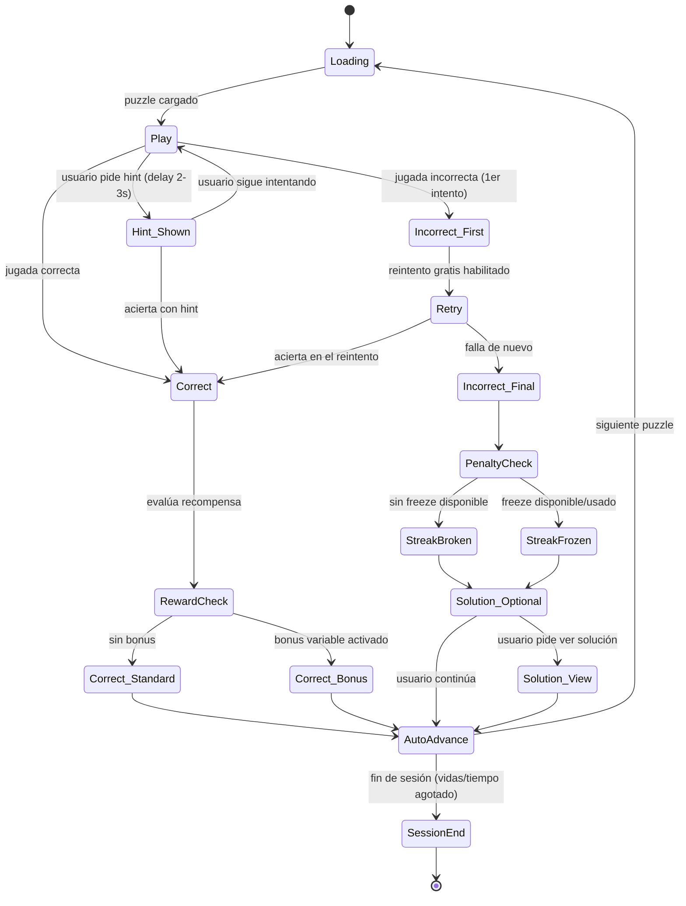

# App de Puzzles de Ajedrez — Research de Retención y Spec de Producto
### Documento maestro consolidado

---

## 0. Contexto y objetivo

Diseñar la app de puzzles de ajedrez más adictiva posible ("la TikTok de los puzzles de ajedrez"), partiendo de un análisis competitivo de las apps top del mercado (Chess.com, Lichess, ChessKid, etc.) y de mecánicas de retención probadas fuera del nicho de ajedrez (Duolingo, Focus Plant, Strava).

Principio rector de todo el documento: **refuerzo variable, no refuerzo constante.** El feedback determinista (bien/mal siempre igual) que usan Chess.com y Lichess es correcto pedagógicamente pero aburrido neurológicamente. La recompensa impredecible es lo que engancha de verdad — y debe infiltrar cada capa: el puzzle mismo, la colección cosmética, y el sistema social.

---

## 1. Resumen del análisis competitivo

**Apps analizadas:** Chess.com, Lichess, ChessKid (alta confianza) + ChessTempo, Magnus Trainer, Chess Puzzle Pro, Chess Tactics Pro, iChess, CT-ART, Puzzle Chess: Mate in 1-5 (confianza media/baja — no hay 10 apps de puzzles puros con volumen comparable a las tres primeras).

**Patrón compartido por las apps grandes en "Resuelto mal":**
1. Feedback inmediato en el tablero (casilla en rojo) + opción de reintentar antes de ver la solución
2. Botón de solución/análisis separado, no automático — el usuario decide si quiere ver por qué falló

**Fricciones de UX reportadas por usuarios reales (oportunidad de diferenciación):**
- Chess.com Puzzle Rush: bugs recurrentes al revisar la solución de puzzles fallados al final de la ronda
- Lichess mobile: botón de análisis muy pequeño y pegado al de "continuar", genera toques accidentales
- ChessKid: la baja de rating tras fallar es fuerte (~25 pts) y genera frustración reportada por padres

**Conclusión aplicada:** el punto más débil de las apps líderes es la experiencia alrededor del fallo (revisión poco accesible, castigo desproporcionado). Ahí está el mayor espacio de diferenciación de UX.

---

## 2. Spec de flujo de estados del puzzle

### Diagrama de estados



### Detalle de cada estado

**`Play`** — Tablero full-screen, sin chrome de navegación, sin countdown visual (genera ansiedad tipo examen). Ícono de hint discreto (no botón grande) con delay artificial de 2-3s antes de revelar. Racha visible arriba, sin explicación. Sin botón de "rendirse" fácil de encontrar. Sin botón de "siguiente puzzle" — no debe existir salida fácil sin resolver o pedir hint.

*Selección de dificultad:* 85% FSRS estándar según rating; 15% variable (sin patrón fijo) inyectado 1-2 niveles más fácil de lo esperado — genera microrachas de victorias fáciles sin que el usuario note el patrón.

**`Incorrect_First` → `Retry`** — Sin penalización todavía. Feedback ámbar suave (no rojo agresivo) + haptic corto. Mensaje tipo "Casi — intenta de nuevo", nunca "Incorrecto" en rojo grande. Tablero vuelve a posición inicial automáticamente.

**`Incorrect_Final`** — Un único costo, nunca tres a la vez: rompe streak (recomendado) O baja rating silencioso en segundo plano O pierde vida — nunca combinados.

**`PenaltyCheck → StreakFrozen`** — Sistema de "freezes" (0-3 acumulados): se ganan 1 cada 7 días de racha activa, se compran con moneda in-app, o se ven vía ad rewarded (AdMob). Se consume automáticamente el primer fallo del día si hay disponible, sin preguntar — se informa después. Momento óptimo de monetización: cuando se agotan los freezes y rompe racha.

**`Solution_Optional`** — Botón discreto "Ver por qué", opcional. Si no se toca en ~2s, aparece sutilmente el botón de continuar. Nunca pantalla bloqueante.

**`Correct → RewardCheck`** — Lógica de refuerzo variable:

```
probabilidad_bonus_base = 0.12  // 12% de los aciertos
+ 0.05 si viene de racha de 5+ correctos seguidos
+ 0.08 si es la primera sesión del día
+ 0.10 si no ha recibido bonus en los últimos 8 puzzles
// nunca anunciado de antemano, sin contador visible
```

El bonus se siente como mérito, nunca se anuncia como suerte. `Correct_Standard`: check verde, sonido corto, avance automático en ~600ms.

**`AutoAdvance`** — Sin botón "siguiente", transición automática. Decisión de diseño más importante del spec: cada botón que hay que presionar es una oportunidad de abandono.

**`SessionEnd`** — Por vidas agotadas o tiempo objetivo. Resumen con el stat más favorable de esa sesión destacado (varía cuál se muestra — otra aplicación de refuerzo variable, a nivel sesión).

### Eventos PostHog — capa core

| Evento | Cuándo | Propiedades clave |
|---|---|---|
| `puzzle_loaded` | Entra a `Play` | `puzzle_id`, `difficulty_rating`, `is_easy_injection`, `session_puzzle_index` |
| `puzzle_hint_requested` | Tap en hint | `puzzle_id`, `time_to_hint_ms` |
| `puzzle_move_incorrect` | Primer error | `puzzle_id`, `attempt_number`, `time_to_move_ms` |
| `puzzle_retry_started` | Entra a `Retry` | `puzzle_id` |
| `puzzle_solved` | Acierto (con o sin hint) | `puzzle_id`, `used_hint`, `attempts`, `time_total_ms`, `bonus_triggered`, `streak_after` |
| `puzzle_failed_final` | `Incorrect_Final` | `puzzle_id`, `time_total_ms` |
| `streak_broken` | Racha rota sin freeze | `streak_length_before` |
| `streak_frozen` | Freeze consumido | `freezes_remaining` |
| `solution_viewed` | Tap en "Ver por qué" | `puzzle_id`, `context` |
| `session_ended` | Fin de sesión | `puzzles_solved`, `puzzles_failed`, `session_duration_s`, `accuracy_pct`, `end_reason` |
| `freeze_purchased` | Compra/gana freeze | `method` |
| `notification_streak_risk_sent/opened` | Push de racha en riesgo | `hours_remaining`, `streak_length` |

**Funnels prioritarios:** (1) `puzzle_loaded → puzzle_solved` cortado por dificultad; (2) `puzzle_move_incorrect → puzzle_retry_started → puzzle_solved`; (3) `notification_streak_risk_sent → opened → session_ended` — este último valida o mata toda la estrategia de retención vía notificaciones.

---

## 3. Sistema de progresión cosmética: "El Reino"

Capa 100% separada de la lógica funcional (Elo/FSRS) — nunca debe influir en qué puzzles ve el usuario ni en la dificultad servida. Si empieza a influir ahí, deja de ser decoración y se vuelve manipulación de la experiencia de aprendizaje.

**Narrativa:** el usuario reconstruye un reino en ruinas, piedra por piedra, con cada puzzle resuelto.

**Moneda — Coronas:** 1 por puzzle resuelto. El bonus variable del punto 2 da **Coronas de Oro** (mismo mecanismo de refuerzo variable, capa visual). Nunca se restan por fallar — ese castigo vive en el sistema de streak/freeze, no aquí (mezclar ambos diluye el efecto de los dos).

**Colección — Salones del Reino:** organizada por tema táctico dominado, no arbitraria como una colección genérica de objetos — comunica maestría real.
- Torre del Clavado (pins)
- Salón de la Horquilla (forks)
- Bóveda del Sacrificio (sacrifices)
- Cámara del Jaque Mate (mates)
- Muralla de la Defensa (defensive tactics)

Cada salón con 5 niveles de "construcción", pagados con Coronas + puzzles resueltos de ese tema. Ventaja sobre "rating frío": "tu Torre del Clavado está en ruinas" comunica lo mismo que "tu rating en pins es bajo" con un marco emocional completamente distinto. Skins de piezas/tableros se desbloquean por hitos generales (rachas, milestones), separado del sistema de maestría.

**Anti-mecánica — Asedio:** tras 48-72h de inactividad, el reino entra en asedio visual (murallas agrietadas, antorchas apagadas). Reversible al instante al volver a jugar (primer puzzle resuelto repara todo de golpe — efecto satisfactorio). Notificación asociada: *"Tu reino está bajo asedio"* — más específica y visual que un genérico "no pierdas tu racha". A futuro: **Mapa del Reino** compartido entre amigos, territorios activos más grandes/luminosos que los inactivos — presión social pasiva.

**Por qué es más defendible que copiar una mecánica genérica de otra categoría (ej. Focus Plant):** la colección está anclada a tu propia taxonomía de temas tácticos, no es un sistema genérico replicable en un fin de semana por un copycat.

### Eventos PostHog — capa Reino

| Evento | Cuándo | Propiedades |
|---|---|---|
| `crown_earned` | Puzzle resuelto | `puzzle_id`, `is_gold`, `amount` |
| `hall_progress` | Coronas invertidas en un salón | `hall_id`, `level_before`, `level_after` |
| `hall_completed` | Salón a nivel máximo | `hall_id`, `days_to_complete` |
| `siege_started` | 48-72h sin actividad | `hours_inactive`, `hall_levels_current` |
| `siege_ended` | Vuelve a jugar tras asedio | `hours_in_siege` |
| `notification_siege_sent/opened` | Push de asedio | `hours_inactive` |
| `cosmetic_unlocked` | Skin desbloqueado | `cosmetic_id`, `unlock_method` |

**Funnel clave:** `siege_started → notification_siege_sent → opened → siege_ended` — valida si la narrativa de asedio convierte mejor que el genérico de racha. Si la diferencia es marginal, no justifica el costo de producción visual.

---

## 4. Otras estrategias de retención (fuera del nicho de ajedrez)

Referencia: Duolingo, Strava, Robinhood — mecánicas con evidencia fuerte de mover retención D30, no incluidas en las secciones 2-3.

**Ligas semanales** *(la de mayor ROI potencial, recomendada como próxima pieza a especificar)*
Cohortes de ~30 usuarios de nivel similar, ascenso/descenso semanal. Más efectivo que un leaderboard global: siempre compites contra gente a tu alcance, nunca contra el #1 del mundo. Implementable sobre Supabase con cohortes + cron semanal.

**Primer sesión calibrada para victoria garantizada**
El primer puzzle de un usuario nuevo debe estar sesgado hacia fácil — la primera experiencia debe ser "lo resolví, se siente bien" antes de que el algoritmo empiece a retarlo de verdad.

**Sistemas de progreso paralelos**
Racha + Coronas + progreso de Salón + liga semanal corriendo simultáneamente e independientes. Si la única métrica es la racha y se rompe, no queda nada por lo que quedarse; con varios sistemas paralelos, romper uno no mata la motivación de los otros.

**Widget de pantalla de inicio / lock screen**
Top-of-mind pasivo genera más aperturas que cualquier notificación. Widget simple: racha actual + puzzle del día pendiente. Barato de construir, retorno alto.

**Recap periódico compartible ("Wrapped")**
Resumen mensual/anual (puzzles resueltos, % de precisión, salón dominado) — retención (narrativa de progreso) + adquisición viral (se comparte sin pedirlo). Alto retorno, bajo costo.

**Loop de referidos con incentivo mutuo**
Recompensa a ambas partes al invitar (no solo a quien invita) — casi duplica la tasa de conversión vs. recompensar solo a uno. Ej: Coronas de bonus o freeze gratis para ambos.

**Win-back con oferta y fecha de caducidad**
Para usuarios con 7-14 días de inactividad: no push genérico, sino oferta concreta con urgencia ("vuelve en 48h y recupera tu racha de 12 días congelada"). Explota pérdida + urgencia + camino de regreso fácil.

---

## 5. Priorización sugerida

**V1 (validar retención base antes de cualquier capa cosmética):**
- Spec de flujo de estados completo (sección 2)
- Sistema de streak + freeze
- Refuerzo variable en el acierto (bonus aleatorio)
- Primer sesión calibrada para victoria garantizada

**V2 (una vez validado D7/D30 con lo anterior):**
- "El Reino" completo (sección 3)
- Ligas semanales
- Widget de pantalla de inicio
- Recap compartible

**V3 / oportunista:**
- Loop de referidos
- Win-back con oferta
- Mapa del Reino social

El criterio para pasar de V1 a V2 no es tiempo, es dato: retención D7 de la app base antes de invertir en capas cosméticas. Construir "El Reino" antes de validar el core sería resolver el problema equivocado primero.

---

## 6. Nota de tensión ética

Este diseño está optimizado deliberadamente para retención/adicción. Vale la pena decidir explícitamente, no por default:
- Dejar el refuerzo variable y la ocultación de rating como feature flag (`reward_variance_enabled`) desde el inicio, para poder ofrecer a futuro un "modo honesto" (rating siempre visible, sin bonus oculto) a un segmento de usuarios más serios, sin reconstruir el sistema después.
- Limitar las notificaciones de pérdida (racha/asedio) a una por evento de riesgo, nunca diarias genéricas — es la palanca más potente pero también la que más rápido genera fatiga y desinstalaciones si se abusa.
