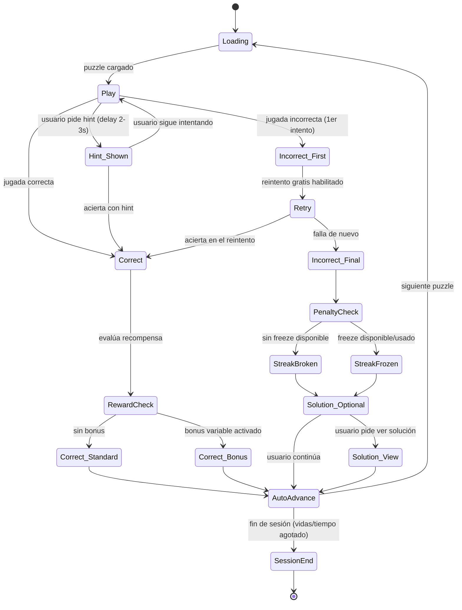

# Spec: Flujo de estados de la pantalla de puzzle
### Para implementación en Claude Code — React Native + Expo + Supabase + FSRS + PostHog

---

## 1. Diagrama de estados



---

## 2. Detalle de cada estado

### `Play`
**Qué muestra:** tablero full-screen, sin chrome de navegación visible, temporizador oculto (no mostrar countdown visual — genera ansiedad tipo "examen", reduce sesiones largas).

**Elementos UI:**
- Tablero interactivo (drag + tap-to-move)
- Ícono hint (esquina, discreto, NO botón grande) — al tocarlo dispara `Hint_Shown` con delay artificial de 2-3s antes de revelar (loading spinner intencional)
- Racha actual visible arriba (número + ícono de fuego), sin explicación — la ambigüedad genera curiosidad las primeras veces

**No mostrar:** botón "rendirse", botón "siguiente puzzle" (no debe existir salida fácil del puzzle actual sin resolverlo o pedir hint).

**Lógica de selección de puzzle:**
- 85% de los puzzles: dificultad FSRS estándar según rating del usuario
- 15% (variable, pseudoaleatorio con seed por sesión, nunca en patrón fijo tipo "cada 5") : puzzle 1-2 niveles MÁS FÁCIL de lo esperado → genera racha de victorias fáciles sin que el usuario note el patrón

---

### `Incorrect_First` → `Retry`
**Qué pasa:** NO se muestra penalización todavía. Feedback visual suave (casilla se ilumina en ámbar, no rojo agresivo) + vibración corta (haptic).

**UI:** mensaje breve tipo "Casi — intenta de nuevo" (nunca "Incorrecto" en rojo grande — eso es lo que hace Chess.com/ChessKid y genera el rage-quit reportado en reseñas).

**Transición:** tablero vuelve a la posición inicial del puzzle automáticamente, sin botón que presionar.

---

### `Incorrect_Final` (falla el reintento)
**Aquí SÍ se aplica un único costo** — elegir UNO:
- Opción recomendada: rompe streak (visual: el ícono de fuego se apaga con animación)
- El rating FSRS se actualiza siempre en segundo plano, silenciosamente — nunca mostrado como número que baja en pantalla

**No hacer:** mostrar rating bajando Y racha rompiéndose Y perder vida al mismo tiempo.

---

### `PenaltyCheck` → `StreakFrozen`
**Lógica del freeze:**
- Usuario tiene 0-3 "freezes" acumulados (se ganan: 1 cada 7 días de racha activa, o se compran con moneda in-app, o ve un ad rewarded de AdMob)
- Si tiene freeze disponible: se consume automáticamente la primera vez que falla en el día (no se pregunta — se aplica y se informa después: "Tu racha estuvo a salvo hoy 🔥❄️")
- Esto es tu primer gancho de monetización natural: cuando se le acaban los freezes y rompe racha, ahí es el momento óptimo para ofrecer comprar uno (no antes, no como paywall genérico)

---

### `Solution_Optional`
**UI:** un solo botón discreto "Ver por qué" — opcional, no forzado. Si el usuario no lo toca en ~2s, aparece sutilmente el botón de continuar (no hay pantalla bloqueante).

---

### `Correct` → `RewardCheck`
**Lógica de refuerzo variable (el corazón del sistema de adicción):**

```
probabilidad_bonus_base = 0.12  // 12% de los aciertos

// aumenta si:
+ 0.05 si viene de una racha de 5+ correctos seguidos
+ 0.08 si es la primera sesión del día
+ 0.10 si el usuario no ha recibido bonus en los últimos 8 puzzles (evita que se sienta "nunca me toca")

// el bonus nunca se anuncia de antemano ni tiene contador visible
```

**Qué es el "bonus":** animación distinta (confeti, sonido único, +2x en la moneda del juego), NUNCA texto que diga "ganaste por suerte" — debe sentirse como si lo hubiera ganado por mérito.

**`Correct_Standard`:** check verde simple, sonido corto, avance automático en ~600ms (suficientemente rápido para no romper flow, suficientemente lento para registrar el logro).

---

### `AutoAdvance`
Sin botón "siguiente". Transición automática. Esta es la decisión de diseño más importante de todo el spec — cada botón que el usuario tiene que presionar es una oportunidad de abandono. Chess.com y Lichess requieren interacción para avanzar; tu app no debería.

---

### `SessionEnd`
Se dispara por:
- Vidas agotadas (si usas sistema de vidas tipo Puzzle Rush), o
- Tiempo de sesión objetivo alcanzado (ej. después de X minutos, sugerir salir — contraintuitivo pero genera confianza y hace que vuelvan más seguido; esto es opcional/A-B testeable, no imprescindible para v1)

**UI de cierre:** resumen de sesión con el stat más "orgulloso" destacado arriba (no siempre el mismo stat — variar entre streak, puzzles resueltos, % de precisión, tiempo — según cuál se vea mejor esa sesión). Esto es otra aplicación del refuerzo variable a nivel de sesión completa.

---

## 3. Eventos PostHog

Convención: `snake_case`, patrón `objeto_accion`.

| Evento | Cuándo se dispara | Propiedades clave |
|---|---|---|
| `puzzle_loaded` | Al entrar a `Play` | `puzzle_id`, `difficulty_rating`, `is_easy_injection` (bool), `session_puzzle_index` |
| `puzzle_hint_requested` | Tap en hint | `puzzle_id`, `time_to_hint_ms` |
| `puzzle_move_incorrect` | Primer error | `puzzle_id`, `attempt_number`, `time_to_move_ms` |
| `puzzle_retry_started` | Entra a `Retry` | `puzzle_id` |
| `puzzle_solved` | Cualquier acierto (con o sin hint) | `puzzle_id`, `used_hint` (bool), `attempts`, `time_total_ms`, `bonus_triggered` (bool), `streak_after` |
| `puzzle_failed_final` | `Incorrect_Final` | `puzzle_id`, `time_total_ms` |
| `streak_broken` | Se rompe racha sin freeze | `streak_length_before` |
| `streak_frozen` | Se consume un freeze | `freezes_remaining` |
| `solution_viewed` | Tap en "Ver por qué" | `puzzle_id`, `context` (`after_fail`) |
| `session_ended` | Fin de sesión | `puzzles_solved`, `puzzles_failed`, `session_duration_s`, `accuracy_pct`, `end_reason` (`lives`/`time`/`manual`) |
| `freeze_purchased` | Compra o gana freeze vía ad | `method` (`ad_rewarded`/`iap`/`earned_streak`) |
| `notification_streak_risk_sent` | Push enviado (server-side, pero registrar en PostHog vía backend event) | `hours_remaining`, `streak_length` |
| `notification_streak_risk_opened` | Usuario abre la app desde esa notif | `hours_remaining_at_open` |

**Funnels sugeridos para armar en PostHog desde el día 1:**
1. `puzzle_loaded → puzzle_solved` (tasa de resolución, cortado por dificultad)
2. `puzzle_move_incorrect → puzzle_retry_started → puzzle_solved` (efectividad del reintento gratis)
3. `notification_streak_risk_sent → notification_streak_risk_opened → session_ended` (ROI real de la notificación de pérdida de racha — este es el funnel que valida o mata toda la estrategia de retención)

---

## 4. Notas de tensión ética (para que quede explícito, no implícito)

Este diseño está optimizado deliberadamente para retención/adicción, como pediste. Dos cosas vale la pena decidir ahora, no después:
- El refuerzo variable y la ocultación del rating real funcionan mejor cuanto menos transparentes son — pero si en algún momento quieres una versión "modo honesto" (mostrar rating real siempre, sin bonus aleatorio) para un segmento de usuarios más serios/adultos, es más barato dejarlo como feature flag desde ahora que agregarlo después.
- Las notificaciones de pérdida de racha son la palanca más potente pero también la que más rápido genera fatiga/desinstalaciones si se abusa — limitar a 1 por racha activa, nunca diaria genérica.

Puedo dejar esto como flag en PostHog (`reward_variance_enabled`) para que actives/desactives el modo agresivo por cohorte y midas el impacto real en D7/D30 retention antes de comprometerte.
